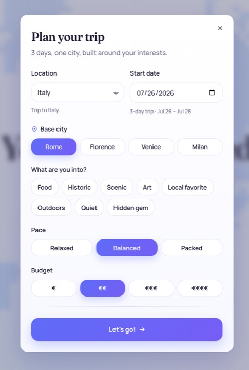
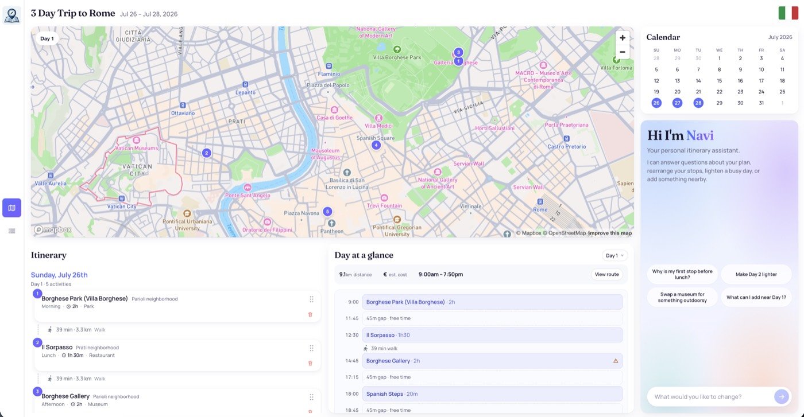
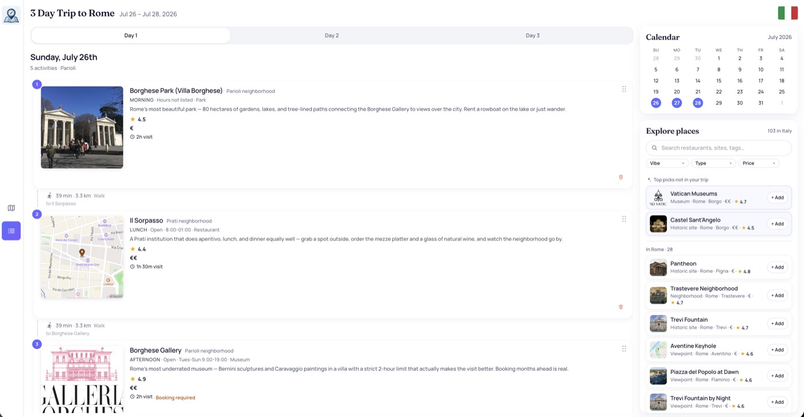

# 3 Days in Italy — Trip Planner

You pick a base city, a start date and a few preferences, and a deterministic engine builds a
3-day itinerary out of the 103 places in `src/data/italy.json`. From there you edit it yourself,
or ask **Navi**, which changes the trip through the same functions the buttons call.

React 19 · TypeScript · Vite · Mapbox GL · Vercel Functions · OpenAI `gpt-4.1`

**Live demo:** https://trip-planner-bronson.vercel.app
· **Submission note:** [`docs/WRITE_UP.md`](docs/WRITE_UP.md)

---

## Screenshots








---

## Quick start

```bash
npm install
cp .env.example .env    # add your two keys
npm run dev
```

| Variable | Purpose |
|---|---|
| `MAPBOX_API_KEY` | Map tiles, walking routes, place thumbnails. **Public `pk.` token** — it reaches the browser, but it is never committed: `placeImages.json` stores Mapbox URLs unsigned and `placeImageUrl()` in `src/data/places.ts` signs them at read time. |
| `OPENAI_API_KEY` | The Navi assistant. Server-side only, never bundled into the client. |
| `APP_ORIGIN` | An extra allowed origin for `/api/assistant`. Optional. The deployment's own origin and `VERCEL_URL` are already allowed, so you only need this for a custom domain. |

`npm run dev` serves the frontend and `/api/assistant` from one process, so you don't need
`vercel dev`.

Without `OPENAI_API_KEY` the app still works, you just lose Navi. Planning and every manual edit
run client-side with no network call.

### Scripts

```bash
npm run dev         # frontend + assistant API (Vite middleware)
npm run build       # typecheck + production build + bundle:api
npm run bundle:api  # esbuild server/assistant.ts → api/assistant.js
npm test            # unit tests (vitest)
npm run lint        # oxlint
```

---

## Features

**Plan.** Choose Rome, Florence, Venice or Milan, a start date, interest chips, pace and budget.
Places are ranked by a weighted score (preference match, rating, authenticity, budget fit), then
scheduled into days that stay geographically clustered and run morning sight, lunch, afternoon,
evening, dinner. Pace controls how many sights pack in between the meals.

**Map view.** Mapbox pins numbered per day, click to focus, toggle a real walking route for any
day.

**List view.** Detailed stop cards with images, hours, duration, price, rating and tags.

**Day at a glance.** The selected day laid out on a wall clock, so you can see when a day is over-
or under-packed.

**Explore.** Browse places eligible for the current trip, search by name, neighborhood, type or
tag, filter by price, and add anything to a specific day. Rows outside your base city are
browse-only.

**Edit.** Drag to reorder, remove stops, add from Explore. Travel estimates and day themes
recompute immediately.

**Navi.** An assistant scoped to the trip on screen, for the things buttons can't express:

| | |
|---|---|
| Questions | *"Why is my first stop before lunch?"* · *"What's near my Day 1 dinner?"* |
| Compound edits | *"Swap the museum for something outdoorsy near the coast, under budget"* |
| Re-plans | *"Make Day 2 lighter and move something to Day 3"* |

---

## How it works

```
┌── browser ─────────────────────────────────────────────────────────┐
│                                                                    │
│   planner form      map · list · explore · edit      Navi chat     │
│         │                      │                         │         │
│         └──────────────────────┴─────────────────────────┘         │
│                                │                                   │
│                                ▼                                   │
│    src/lib/trip/tools.ts   pure TripState → TripState              │
│    searchPlaces · explainStop · nearbyPlaces · addStop             │
│    removeStop · swapStop · reorderStop · rebalanceDay              │
│                                │                                   │
│                                ▼                                   │
│    TripState  { city, startDate, prefs, days: [{ placeId, slot }] }│
│                                │                                   │
│                                ▼  resolveTrip() on every render    │
│    normalize(italy.json) → rankPlaces → buildItinerary → cards     │
│                                                                    │
└────────────────────────────────────────────────────────────────────┘
          │                                    │
          │ Navi messages only                 │ tiles, routes, images
          ▼                                    ▼
┌── /api/assistant ──────────────────┐   ┌── Mapbox GL ─────────────┐
│  zod · 500-char cap · rate limit   │   │  map, walking routes,    │
│  CORS · structured logging         │   │  place thumbnails        │
│                                    │   └──────────────────────────┘
│  tool-calling loop, max 5 steps ───┼──► OpenAI gpt-4.1
│  returns tool calls, never state   │
└────────────────────────────────────┘
```

The itinerary is one small serializable object, `{ city, startDate, prefs, days: [{ placeId,
slot }] }`. Ids only. It's simultaneously the React state, the sessionStorage format and the API
wire format, and everything displayed (resolved places, walking times, dates) is derived from it
on render.

Both the buttons and the assistant mutate it through the same pure functions in
`src/lib/trip/tools.ts`. The chat is optional and every edit works without it.

### Ranking

`scorePlace` in `src/lib/places/score.ts` takes a place and your preferences and returns a score.
No AI, no I/O, no randomness. The weights live in one visible constant instead of being tuned
inline:

| Signal | Weight | How it's computed |
|---|---|---|
| Preference match | +3 per matched tag | Your interest chips matched against the place's canonical tags |
| Rating | +2 max | Normalized 0..1 across the dataset's 2.0–5.0 range |
| Authenticity | ±1 scaled | Signed hidden-gem ↔ tourist-heavy axis, multiplied by your stance (-2..+2) |
| Budget | -2 per level of drift | Distance between the place's price level and your target |

The relative sizes are the actual decision. Preference match is weighted highest so a place you
asked for at 4.2 stars beats one you didn't at 4.8. Rating is normalized into 0..1 for the same
reason, since raw 2.0–5.0 values would otherwise swamp everything else. Budget is a penalty rather
than a bonus, so it only ever demotes places outside what you said you'd spend and never promotes
a cheap place you have no interest in. Authenticity is signed and multiplied by your stance, which
means one weight handles both "find me hidden gems" and "I want the famous must-sees" without a
second branch.

`scorePlace` returns the per-signal breakdown rather than just the total. That's what `explainStop`
reads back when you ask Navi why something is in your trip, and what the tests assert against, so
the ranking can't drift without a test noticing.

### Scheduling

`buildItinerary` picks the base city, filters to places that are eligible for it and open on your
actual dates, then fills a fixed slot template per day. Meals are constant and pace only changes
how many sights pack between them:

```
relaxed    morning · lunch · afternoon · dinner
balanced   morning · lunch · afternoon · evening · dinner
packed     morning · lunch · afternoon · afternoon · evening · dinner
```

Meals are chosen within 2.5 km of the day's geographic center, falling back to the closest
available if nothing is in range, since a slightly distant dinner still beats an empty slot.

The LLM is never in the correctness path. It reads the request and picks tools, and the tools are
what check that a place exists, that it's open that day, and that you can get to it. The model
never types a place id from memory. It gets candidates back from `searchPlaces`, passes those
exact ids on, and every write tool re-validates them against the dataset before it mutates
anything. The loop is capped at five tool steps, and `removeStop` is withheld unless the
instruction explicitly asks to remove something.

### Security, and what it does and doesn't cover

`/api/assistant` is the only server surface. What it enforces:

| Control | Where | What it actually buys |
|---|---|---|
| zod schema validation | on the request body | Malformed or oversized payloads never reach the model |
| 500-character instruction cap | on the user message | Bounds prompt size and token spend per call |
| Per-IP rate limiting | 10 requests / minute | The real cap on abuse and runaway cost |
| Origin check | `allowedOrigin()` | Stops another site spending the OpenAI key from its visitors' browsers |
| 5-step tool loop cap | in the agent loop | A confused model can't loop forever on your budget |
| `removeStop` withheld | tool selection | Destructive edits need an explicit instruction, enforced in code |
| Id re-validation | every write tool | A hallucinated id can't reach `TripState`, even if the model invents one |

Worth being clear about the limits. The origin check only constrains browsers, since a request
sent without an `Origin` header isn't a browser request at all and passes through — that's correct
behavior, but it means rate limiting is what carries the load. The rate limiter is in-process, so
it resets on cold start and isn't shared across function instances; a real deployment would move it
to Redis or Vercel KV.

Two trust boundaries are worth naming. `OPENAI_API_KEY` is server-only and structurally excluded
from the client by `envPrefix: ['VITE_', 'MAPBOX_API_KEY']` in `vite.config.ts`, so it can't leak
by accident. The Mapbox `pk.` token does reach the browser, which is how Mapbox GL works, and the
control for it is domain-restricting the token in the Mapbox dashboard rather than anything in
this repo.

The gap I'd close first: Navi's topic scope is a line in the system prompt, which is the weakest
place to enforce anything. `searchPlaces` also puts place names and tags from `italy.json` directly
into the model's context, so the dataset is a second injection route alongside the user message.
Neither is guarded in code today.

**Data.** `italy.json` is never mutated. A one-way `normalize()` pass parses ~8 hours formats
(including overnight windows), defaults missing durations, and canonicalizes tags. Every
inference it makes is labeled, so hours it can't parse reach the card as "check ahead" rather
than a made-up time. An `auditPlaces()` pass logs data-quality findings at startup in dev.

---

## Project structure

```
server/assistant.ts      Source for the tool-calling loop (bundled to api/assistant.js for Vercel)
api/assistant.js         Committed esbuild bundle — Vercel detects `/api` before build runs
src/
  config/mapbox.ts       the only client-side read of the public Mapbox token
  data/
    italy.json           source of truth (immutable)
    placeImages.json     unsigned Mapbox / Wikipedia image URLs
    places.ts            normalize + placeImageUrl()
    tripPlan.ts          TripPlan defaults / types
    cities.ts            plannable base cities
  lib/
    places/              the dataset and what it means
      normalize.ts       raw → attributed typed view
      tags.ts            tag taxonomy
      score.ts           weighted ranking
      availability.ts    opening-hours and seasonal checks
      explore.ts         browse/filter the catalog against a trip
      audit.ts           data-quality report
    trip/                the planning engine
      planPrefs.ts       TripPlan → TripPrefs
      itinerary.ts       the scheduler
      tripState.ts       TripState, initTripState, resolveTrip
      tools.ts           shared tool layer (UI + assistant)
      dayGlance.ts       wall-clock layout
    geo/directions.ts    distance estimates + Mapbox walking routes
    dates.ts             date parsing and formatting
  components/
    home/                Hero, planner form
    dashboard/
      shell/             header, sidebar
      shared/            Panel, icons and small presentational parts
      itinerary/         list and compact views, stop cards, day at a glance
      calendar/          month calendar
      map/               Mapbox view
      explore/           catalog browser and place detail
      assistant/         Navi
  pages/                 HomePage · DashboardPage
tests/                   unit tests, mirroring lib/ (places · trip · geo)
docs/
  WRITE_UP.md            submission note
  assessment.md          assignment brief
  screenshots/           README images
scripts/                 one-off data helpers (e.g. fetch-place-images)
```

## Deployment

Deploys to Vercel as-is: `vercel.json` rewrites everything except `/api/` to `index.html`. Set
`OPENAI_API_KEY` and `MAPBOX_API_KEY` in the project environment. `APP_ORIGIN` is only needed if
you serve the app from a custom domain, since the Vercel origin is allowed already. The assistant
bundle is regenerated on every `npm run build` via `bundle:api` and must stay committed so Vercel
can detect `/api` before the build runs.
